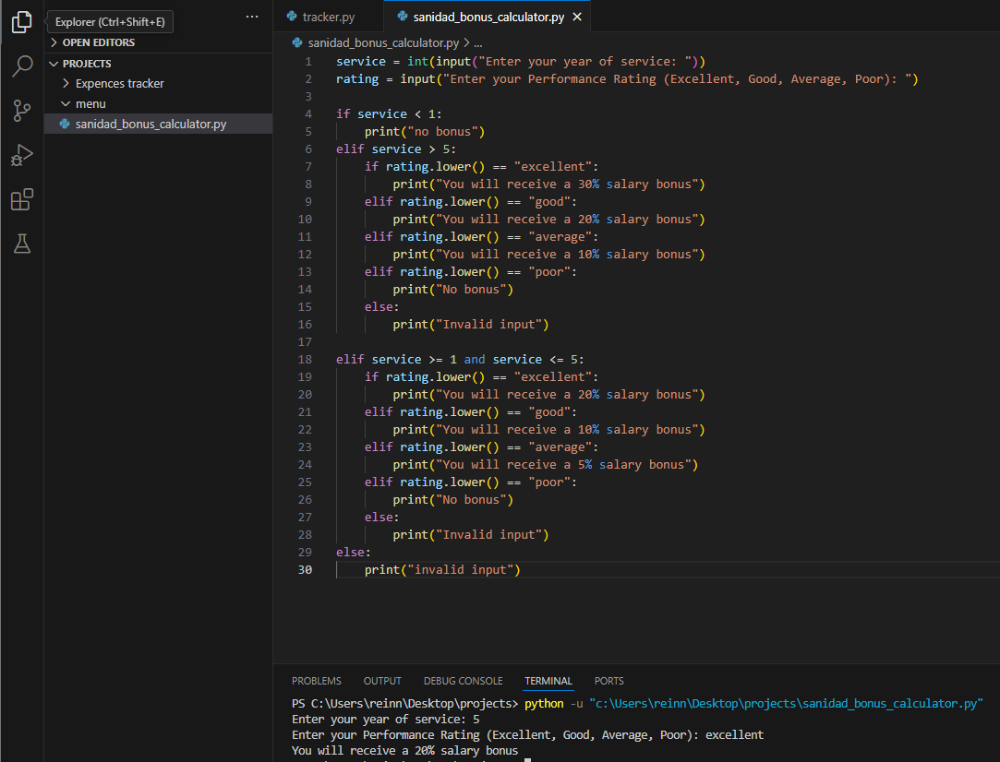

## Activity: Employee Salary Bonus Calculator
in this activity I am going to code a nested if statement for Employee salary bonus

## Overview 
A company calculates year-end bonuses based on an employee’s years of service and performance rating

## Requirements:
- Ask for the employee’s years of service and performance rating (Excellent, Good, Average, Poor).
- Conditions:
  - If the employee has worked less than 1 year, no bonus.
  - If they have worked 1-5 years:
    - Excellent → 20% salary bonus
    - Good → 10% salary bonus
    - Average → 5% salary bonus
    - Poor → No bonus
  - If they have worked more than 5 years:
    - Excellent → 30% salary bonus
    - Good → 20% salary bonus
    - Average → 10% salary bonus
    - Poor → No bonus

## Example Output:
Enter your years of service: 6  
Enter your performance rating (Excellent, Good, Average, Poor): Good  
You will receive a 20% salary bonus.

## Here is the Screenshot of the code

## Here is the source code
[source code](files/bonus_calculator.py)
